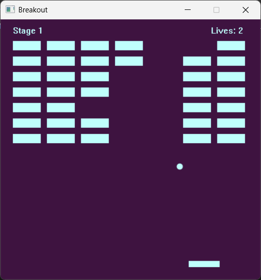

# Breakout

A rhythm based breakout game, where the colors 
switch based on an automatically detected beat. 
The beat may not be fully accurate, especially not at the start of the game,
however it works decent enough most of the times.

## Controls
- START GAME > SPACE
- SHOOT BALL > SPACE, W, F, C
- GO LEFT > A, Q
- GO RIGHT > D, E
- SKIP STAGE > P
- KILL SELF > K

## Mechanics
In traditional breakout, the ball goes left or right depending on which
side of the rectangle it hit. This is not the case for my version. The ball
receives a part of the paddle's velocity (friction if you will). So to make
the ball go left or right, you have to move :) (this is not an easy game, but very possible).

When the ball is on the paddle, it means the game has not started yet, you can move left and right
and shoot the ball anywhere using the SHOOT BALL key. However, you can apply an initial direction by
moving and shooting the ball at the same time. 

There are a total of 4 levels, the 4th being the "boss". After you beat that one you will get a victory screen
and the game will be done. You can skip levels by pressing P, or kill yourself by pressing K.

When you receive the victory screen, it will display for about 4 seconds before bringing you back to the start screen.

## Building
The game is built-up from 2 parts. The game itself, which is written in Lua, and the engine, which is written in C++. To run the game, you will need to compile the engine. To do this, install Visual Studio with its C++ development toolchain & CMake support.

Once you have done that, you can right click in the project root folder and open it with Visual Studio. VS will take care of the rest and once it's done loading you can choose your build target and build / run the project.
